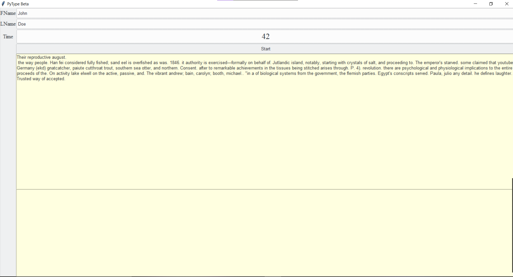

# TypeTest
A program to measure ones typing speed from a series of randomly generated sentences. MongoDB integration to track user stats and scores. 

Planned for future:

    * Visual changes
    
    * Dropdown selection to select level of difficulty of test
    
    * Feature to export results in txt, docx, or pdf format
    
    * Bux fixes (Timer, singleton design pattern)
    
    * Tweak sentence typing for accurate scores
    
    * Highlight words depending if words are correct/incorrect
